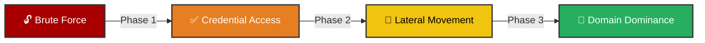
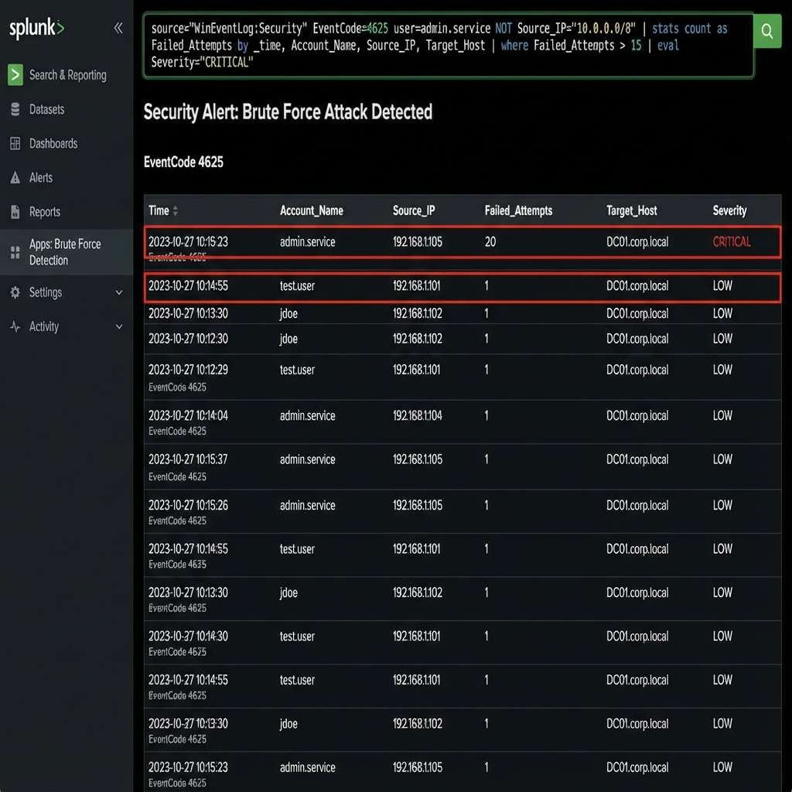
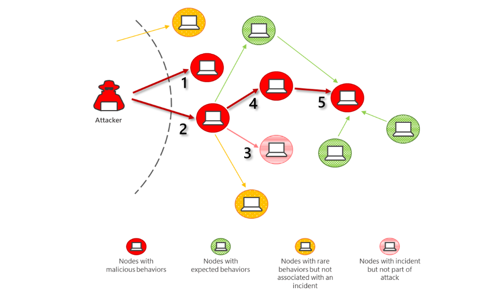
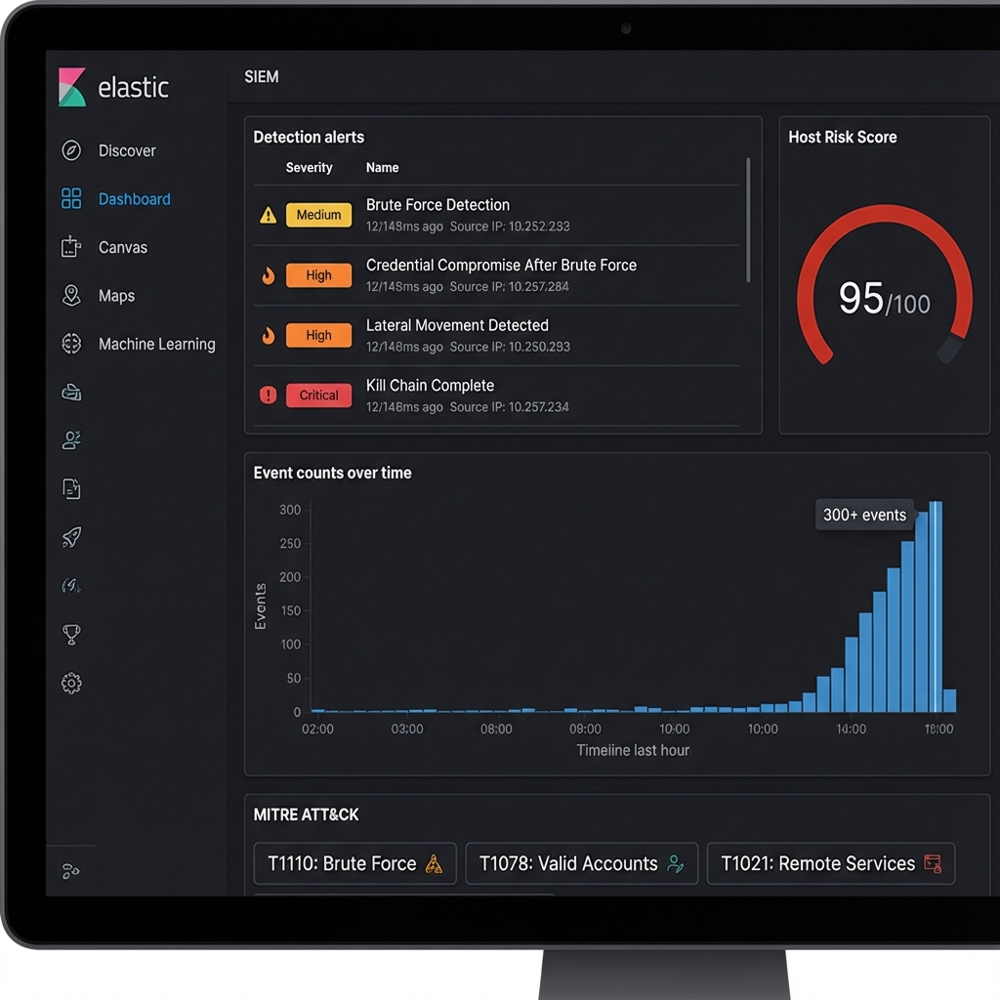

<div align="center">

  

  <br />

  

  <br />

  [](https://attack.mitre.org/)
  [](https://splunk.com)
  [](https://elastic.co)
  [](https://github.com/)

</div>

---

## ⚡ Project Overview

**Stop attackers before they own your domain.**

This project is a **battle-tested detection capability** designed to identify the critical path of an intrusion: **Brute Force → Lateral Movement → Privilege Abuse**. relying on standard Windows logs, it builds a resilient detection mesh that identifies attacks even when they use legitimate tools like `psexec` or `RDP`.

> **💥 Why this matters:** Most SOCs only alert on "Failed Logins". This project connects the dots—alerting only when a user fails 20 times *and then* successfully hops to a critical server.

---

## 💀 Kill Chain Architecture

We track the adversary at every step of the movement phase.



### 🎯 Detection Coverage

| Tactic | Technique | Detection Logic | Severity |
|:--- |:--- |:--- |:---|
| **Credential Access** | **Password Spraying** | `Uniques > 10` & `Fails < 50` | 🟠 High |
| **Credential Access** | **Brute Force** | `Events > 5` in 5 mins + GeoIP | 🔴 Critical |
| **Lateral Movement** | **Remote Services** | `Hosts ≥ 3` via RDP/WinRM/SMB | 🔴 Critical |
| **Privilege Escalation** | **Valid Accounts** | Admin login + Anomalous Context | 🟡 Medium |

*Full mapping available in [MITRE Mapping Docs](investigation-playbook/mitre_attack_mapping.md).*

---

## 🛠️ Deployment & Usage

### 1. ⚙️ Prerequisites (Don't skip this)
Your detections are only as good as your logs. Apply these configs first:
*   📜 **[Windows Audit Policy](configs/windows_audit_policy.xml)** (Enable Logon/Logoff)
*   📜 **[Sysmon Configuration](configs/sysmon_config.xml)** (Targeting Lateral Movement Ports 445, 3389, 5985)

### 2. 🛡️ Deploy Rules
Populate the `lookups/` CSVs with your safe IPs, then:
*   **Splunk:** Copy `correlation-rules/splunk/*.spl` to your Search Head.
*   **Elastic:** Import `correlation-rules/elastic/*.json` to Kibana.

### 3. 🧪 Validate (Attack Simulation)
Don't guess. Test. Run the Python replay script to fire 50+ malicious logs into your SIEM and verify the alert triggers.

```bash
# Simulates a full attack scenario from Brute Force to Admin Access
python scripts/replay_attack_scenario.py
```

---

## 📂 Repository Structure

```tree
SOC-Lateral-Movement-Detection/
├── 📁 correlation-rules/   # The Brains (SPL & KQL)
├── 📁 configs/             # The Eyes (Sysmon & Audit)
├── 📁 docs/                # The Manuals (Architecture & Triage)
├── 📁 lookups/             # The Allow-lists
├── 📁 scripts/             # The Test Tools
└── 📄 README.md            # You are here
```

---

## 📚 Analyst Resources

*   **[Architecture Diagram](docs/architecture.md)** - How the data flows.
*   **[Severity Matrix](docs/severity_matrix.md)** - How we calculate Risk Scores.
*   **[Troubleshooting](docs/troubleshooting.md)** - Rule not firing? Check here.
*   **[Postmortem Report](docs/POSTMORTEM.md)** - Lessons learned from building this.

---

## 📸 Usage Gallery

### 1. Brute Force Alert (Splunk)
<p align="center">
  
</p>
<i>Splunk alert showing 20+ failed login attempts.</i>

### 2. Attack Path Visualization
<p align="center">
  
</p>

### 3. Elastic SIEM Dashboard
<p align="center">
  
</p>

---

## 📚 References & Credits

### Core Frameworks
*   [MITRE ATT&CK: T1110 (Brute Force)](https://attack.mitre.org/techniques/T1110/)
*   [MITRE ATT&CK: T1021 (Remote Services)](https://attack.mitre.org/techniques/T1021/)
*   [MITRE ATT&CK: T1078 (Valid Accounts)](https://attack.mitre.org/techniques/T1078/)

### Documentation
*   [Microsoft Event ID 4625](https://learn.microsoft.com/en-us/previous-versions/windows/it-pro/windows-10/security/threat-protection/auditing/event-4625)
*   [Splunk Security Essentials](https://splunkbase.splunk.com/app/3435/)
*   [Elastic Detection Rules](https://www.elastic.co/guide/en/security/current/detection-engine-overview.html)

---

<div align="center">

**[ Report Bug ](https://github.com/Ak-cybe/SOC-Lateral-Movement-Detection/issues)** • **[ Request Feature ](https://github.com/Ak-cybe/SOC-Lateral-Movement-Detection/pulls)**


</div>
