<p align="center">
  
</p>

<p align="center">
    <a href="https://github.com/Ak-cybe/SOC-Lateral-Movement-Detection/actions"></a>
    <a href="https://attack.mitre.org/"></a>
    <a href="#"></a>
    <a href="LICENSE"></a>
</p>

---

## 🛡️ Project Overview

**SOC Lateral Movement Detection** is a production-ready detection engineering suite designed to identify the complete attack lifecycle—from initial access (Brute Force/Spray) to internal propagation (Lateral Movement) and privilege abuse.

Unlike standard "alert-only" repositories, this project provides a **full operational ecosystem**:
*   **Correlation Rules:** Optimized SPL and Elastic KQL queries.
*   **Validation:** Python-based attack replay scripts for regression testing.
*   **Operations:** Severity scoring matrices, troubleshooting guides, and playbook integration.
*   **Telemetry:** Ready-to-deploy Sysmon and Audit Policy configurations.

---

## ⚡ Attack Chain Architecture

This project maps detections to a realistic kill chain. The architecture relies on log correlation across time windows to reduce false positives.

```mermaid
graph LR
    subgraph "Phase 1: Initial Access"
        A[🔴 Brute Force] -->|Event 4625| B[Detection Rule]
        A2[🟠 Password Spray] -->|Event 4625| B
    end
    
    subgraph "Phase 2: Compromise"
        B -->|Event 4624| C[Context: Login Success]
    end
    
    subgraph "Phase 3: Propagation"
        C -->|Event 4624/Sysmon| D[🔵 Lateral Movement]
    end
    
    subgraph "Phase 4: Impact"
        D -->|Event 4672| E[🟣 Privilege Abuse]
    end

    style A fill:#ff4d4d,stroke:#333,stroke-width:2px,color:#fff
    style A2 fill:#ff9933,stroke:#333,stroke-width:2px,color:#fff
    style D fill:#3366cc,stroke:#333,stroke-width:2px,color:#fff
    style E fill:#9933cc,stroke:#333,stroke-width:2px,color:#fff
```



**[View Full Data Flow Architecture](docs/architecture.md)**

---

## 🎯 Detection Capabilities

| Attack Stage | MITRE Technique | Detection Logic | Operational Impact |
|:--- |:--- |:--- |:--- |
| **Password Spraying** | **T1110.003** | `Unique Users > 10` & `Failures < 50` | Detects "Low & Slow" attacks that bypass lockouts. |
| **Brute Force** | **T1110.001** | `Failed > 5` in 5 mins + GeoIP | Detects targeted flooding attacks. |
| **Lateral Movement** | **T1021** (RDP/SMB) | `Distinct Hosts ≥ 3` in 10 mins | Identifies workstation-to-workstation hopping. |
| **Privilege Abuse** | **T1078.002** | 4672 + Context (Geo/Time) | Contextualizes admin usage (excludes BAU activity). |

---

## 🚀 Quick Start in 5 Minutes

### 1. Prerequisites
Ensure your environment is sending the right data:
*   [Windows Audit Policy](configs/windows_audit_policy.xml) (Enable Logon/Logoff)
*   [Sysmon Config](configs/sysmon_config.xml) (Targeting ports 3389, 445, 5985)

### 2. Configuration
Populate the allowlists to prevent false positives:
```bash
# Add authorized Jump Servers
echo "10.0.1.50,JUMP-BOX-01" >> lookups/admin_jump_servers.csv
```

### 3. Deployment
*   **Splunk:** Import `correlation-rules/splunk/*.spl` into your App.
*   **Elastic:** Import `correlation-rules/elastic/*.json` via Saved Objects.

### 4. Validation
Run the attack simulator to verify rules trigger correctly:
```bash
# Simulates full kill chain logs sent to your SIEM
python scripts/replay_attack_scenario.py
```
*See [Validation Guide](docs/validation_guide.md) for detailed instructions.*

---

## 📚 Documentation Suite

| Document | Purpose | Audience |
|:--- |:--- |:--- |
| **[Architecture](docs/architecture.md)** | Data flow diagrams and component breakdown | Architects |
| **[Severity Matrix](docs/severity_matrix.md)** | Math-based logic for Alert Prioritization | SOC Lead |
| **[Troubleshooting](docs/troubleshooting.md)** | Solutions for "Rule not firing" or "Too noisy" | Analysts |
| **[Project Roadmap](ROADMAP.md)** | Future enhancements and current status | Managers |
| **[Postmortem](docs/POSTMORTEM.md)** | Analysis of project evolution and lessons learned | Everyone |

---

## ⚠️ Scope & Disclaimers
> [!NOTE]
> *   **Privilege Escalation (T1068):** This project focuses on *credential abuse* (T1078), not vulnerability exploitation.
> *   **EventID 4672:** We use this for *context*, never as a standalone alert, to avoid admin-login noise.

---

<p align="center">
    <i>Engineered with <3 for the Blue Team Community</i>
</p>
