<p align="center">
  
</p>

# SOC Lateral Movement Detection

**Multi-stage attack detection for Splunk and Elastic SIEM.**  
Detects Brute Force, Password Spraying, Lateral Movement (RDP/WinRM), and Contextual Privilege Abuse.

---

## 🚀 Quick Start (5 Minutes)

1.  **Prerequisites:**
    -   Enable [Windows Audit Policy](configs/windows_audit_policy.xml).
    -   Install [Sysmon Config](configs/sysmon_config.xml).
2.  **Deploy Lookups:**
    -   Populate `lookups/` CSV files with your environment's safe IPs/Accounts.
3.  **Deploy Rules:**
    -   Copy `correlation-rules/splunk/*.spl` to your Splunk App.
    -   Or import `correlation-rules/elastic/*.json` to Kibana.
4.  **Validate:**
    -   Run `python scripts/replay_attack_scenario.py` to test.

Use the [Validation Guide](docs/validation_guide.md) for full steps.

---

## 📚 Documentation
-   **[Architecture & Data Flow](docs/architecture.md)**
-   **[Troubleshooting Guide](docs/troubleshooting.md)**
-   **[Severity Scoring Matrix](docs/severity_matrix.md)**
-   **[Log Forwarding Guide](docs/log_forwarding_guide.md)**

---

## 🎯 About This Project

This project implements **multi-stage attack detection** using SIEM correlation rules. It detects the complete attack chain from initial brute force attempts through credential compromise to lateral movement across internal systems.

> [!IMPORTANT]
> This project detects **privilege abuse via administrative logons**, not vulnerability-based privilege escalation. 
> *   **Scope:** Events focused on valid credential misuse (T1078).
> *   **Out of Scope:** Exploitation for Privilege Escalation (T1068) is NOT detected by this project.
> *   **Note:** EventID 4672 indicates high-privilege logon assignment and is used for context, not as a standalone alert for exploitation.

### 🔥 Detection Capabilities

| Stage | Event ID | Detection | MITRE Technique |
|-------|----------|-----------|-----------------|
| 1️⃣ Brute Force | 4625 | Failed login threshold | T1110 |
| 2️⃣ Password Spraying | 4625 | Low-volume, multi-account | T1110.003 |
| 3️⃣ Credential Compromise | 4624 | Success after brute force | T1078 |
| 4️⃣ Lateral Movement | 4624 | Multi-host authentication | T1021 |
| 5️⃣ Privilege Abuse | 4672 | High-privilege logon (Context) | T1078.002 |

---

## ⚡ Attack Chain Flow

```mermaid
flowchart LR
    A[🔓 Brute Force<br/>EventID 4625<br/>T1110] --> B[✅ Success<br/>EventID 4624<br/>T1078]
    B --> C[🔀 Lateral Movement<br/>Multi-Host Auth<br/>T1021]
    C --> D[👑 Privilege Abuse<br/>EventID 4672<br/>T1078.002]
    
    style A fill:#ff6b6b,color:#fff
    style B fill:#ffd93d,color:#000
    style C fill:#6bcb77,color:#fff
    style D fill:#4d96ff,color:#fff
```



For a detailed architecture view, see [Architecture.md](docs/architecture.md).

---

## 📂 Repository Structure

```
SOC-Lateral-Movement-Detection/
├── 📁 correlation-rules/   # SPL and JSON rules
├── 📁 configs/             # Sysmon and Audit policies
├── 📁 docs/                # Architecture, Troubleshooting, Severities
├── 📁 lookups/             # CSV Allow lists
├── 📁 scripts/             # Validation scripts
├── 📁 tests/               # Expected test outputs
└── 📄 README.md
```

---

## 🛠️ Detection Logic Details

### Brute Force Detection (Splunk SPL)
```spl
index=wineventlog sourcetype=WinEventLog:Security EventCode=4625
| bin _time span=5m
| stats count as failed_attempts dc(ComputerName) as target_hosts 
  values(ComputerName) as targets by Account_Name, Source_Network_Address, _time
| where failed_attempts > 5
| eval severity=case(failed_attempts>20, "Critical", failed_attempts>10, "High", true(), "Medium")
```

### Lateral Movement Conditions
```
User authenticates to ≥3 distinct internal hosts
├── Within 10-minute time window
├── From same source IP (non-admin workstation)
└── Outside normal admin patterns (Lookups excluded)
```

---

## 🗺️ MITRE ATT&CK Mapping

<p align="center">
  
</p>

| Technique ID | Technique Name | Detection Rule |
|-------------|----------------|----------------|
| T1110 | Brute Force | `brute_force_detection.spl` |
| T1110.001 | Password Guessing | `brute_force_detection.spl` |
| T1078 | Valid Accounts | `successful_login_after_bruteforce.spl` |
| T1021 | Remote Services | `lateral_movement_detection.spl` |
| T1078.002 | Domain Accounts | `kill_chain_alert.spl` |

---

## ⚠️ Assumptions & Limitations

- **Assumes** Windows Security auditing is enabled (Audit Logon Events)
- **Does not detect** kernel-level or vulnerability-based privilege escalation
- **Relies on** log integrity and proper forwarding to SIEM
- **Requires** tuning thresholds based on environment baseline
- **Elastic rules** use cumulative risk scoring across attack stages

---

## 🚀 Quick Start

### Splunk Import
```bash
# Copy SPL files to Splunk saved searches
cp correlation-rules/splunk/*.spl $SPLUNK_HOME/etc/apps/search/local/savedsearches.conf
```

### Elastic Import
```bash
# Import detection rules via Kibana API
curl -X POST "localhost:5601/api/detection_engine/rules/_import" \
  -H "kbn-xsrf: true" \
  -F file=@correlation-rules/elastic/brute_force_detection.json
```

---

## 📸 Screenshots

### � Brute Force Detection Alert
<p align="center">
  
</p>
<p align="center"><i>Splunk alert showing 20+ failed login attempts from attacker IP</i></p>

### ⏱️ Kill Chain Timeline
<p align="center">
  
</p>
<p align="center"><i>Multi-stage attack correlation: Brute Force → Success → Lateral → Privilege Abuse</i></p>

### 🔀 Lateral Movement Visualization
<p align="center">
  
</p>
<p align="center"><i>Network graph showing attacker movement across 6 internal hosts</i></p>

### 📊 Elastic SIEM Dashboard
<p align="center">
  
</p>
<p align="center"><i>Risk score accumulation and detection alerts in Elastic Security</i></p>

### 🎯 Splunk Enterprise Security - Incident Review
<p align="center">
  
</p>
<p align="center"><i>Real-time notable events with risk scores, urgency levels, and security domain classification</i></p>

---

## 📚 References

### MITRE ATT&CK Framework
- [MITRE ATT&CK: Brute Force (T1110)](https://attack.mitre.org/techniques/T1110/)
- [MITRE ATT&CK: Remote Services (T1021)](https://attack.mitre.org/techniques/T1021/)
- [MITRE ATT&CK: Valid Accounts (T1078)](https://attack.mitre.org/techniques/T1078/)
- [MITRE ATT&CK: Domain Accounts (T1078.002)](https://attack.mitre.org/techniques/T1078/002/)

### Windows Security Events
- [Event 4625 - Failed Logon](https://learn.microsoft.com/en-us/previous-versions/windows/it-pro/windows-10/security/threat-protection/auditing/event-4625)
- [Event 4624 - Successful Logon](https://learn.microsoft.com/en-us/previous-versions/windows/it-pro/windows-10/security/threat-protection/auditing/event-4624)
- [Event 4672 - Special Privileges Assigned](https://learn.microsoft.com/en-us/previous-versions/windows/it-pro/windows-10/security/threat-protection/auditing/event-4672)

### SIEM Documentation
- [Splunk Security Essentials](https://splunkbase.splunk.com/app/3435/)
- [Elastic Security Detection Rules](https://www.elastic.co/guide/en/security/current/detection-engine-overview.html)
- [SANS Windows Security Log Encyclopedia](https://www.ultimatewindowssecurity.com/securitylog/encyclopedia/)

### Incident Response
- [NIST SP 800-61: Computer Security Incident Handling Guide](https://csrc.nist.gov/publications/detail/sp/800-61/rev-2/final)
- [SANS Incident Handler's Handbook](https://www.sans.org/white-papers/33901/)


---

## 👤 Author

<p align="center">
  
</p>

<p align="center">
  <b>Amresh Kumar</b><br/>
  <i>SOC Analyst | Security Researcher | Red Team Enthusiast</i>
</p>

<p align="center">
  <a href="https://github.com/Ak-cybe">
    
  </a>
  <a href="https://linkedin.com/in/">
    
  </a>
</p>

---

## 📄 License

MIT License - See [LICENSE](LICENSE) for details

---

<p align="center">
  
</p>

<p align="center">
  
</p>
